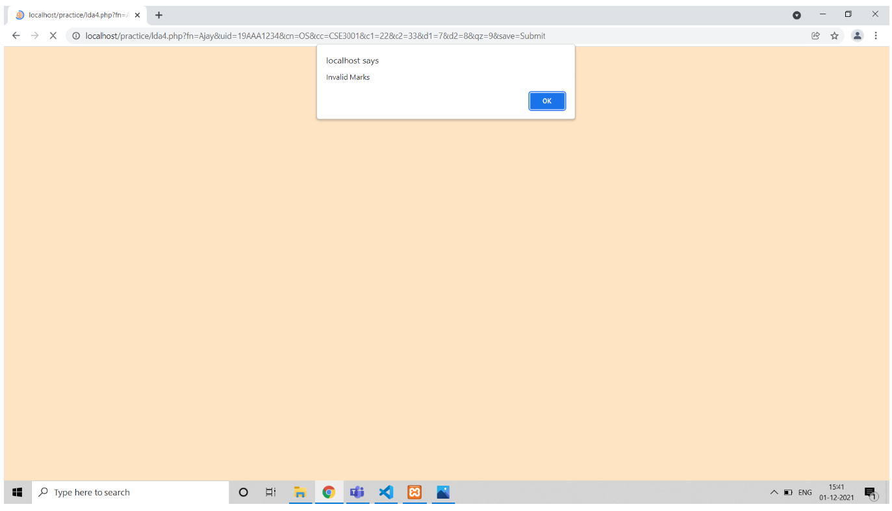

# grades_calc

Through this project we try to accomplish the following things:
      
      Get student details through forms.
      Get marks for different examinations.
      If marks are invalid, show alert.
      Display marks.
      Display CGPA based on marks.

Webpage design:
     

We are creating a database to store the student details , which will also be used to select a student and display their details.

We can enter details through the form

After entering for all subjects the data gets stored in the database

Project Implementation:

